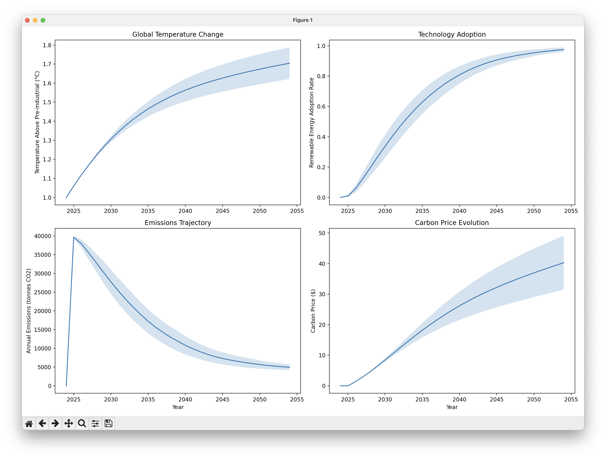

# Agent-Based Model of Climate Solutions with Uncertainty Analysis

## Key Elements of the Model:

1. Base Structure:
- 1000 households and 100 firms modeled as individual agents
- Each agent has unique characteristics: wealth (lognormally distributed), environmental awareness (beta distributed), and geographic location
- Agents form social networks with their 10 nearest neighbors, reflecting real-world influence patterns
- Simulates 30 years from 2024-2054, tracking how the system evolves year by year
- Households and firms can adopt renewable energy based on economic, social, and environmental factors

2. Added Uncertainty Analysis through Monte Carlo Methods:
- Runs the simulation 100 times with varying parameters
- Each run samples key parameters from probability distributions
- Key uncertainties modeled include:
  * Learning rate for renewable technology (15% ± 3%) - how fast costs fall with deployment
  * Environmental awareness distribution - how much agents care about climate
  * Wealth distribution - ability to invest in renewables
  * Temperature sensitivity to emissions - climate system response
  * Social influence factors - how much agents affect each other
  * Carbon pricing mechanisms - policy strength

## Results Show:

1. Temperature Change:
- Mean trajectory shows warming reaching about 1.7°C above pre-industrial by 2054
- Uncertainty band widens over time, reflecting compounding uncertainties
- 95% confidence interval suggests range of ~1.6-1.8°C by 2054
- Temperature rise slows as emissions fall due to renewable adoption

2. Technology Adoption:
- Shows classic S-curve pattern with uncertainty bands
- Slow initial uptake (2024-2028) as early adopters move first
- Rapid acceleration (2028-2040) as costs fall and social influence grows
- Wide range of possible adoption rates during middle years
- Near-complete adoption by 2050 in most scenarios
- Greatest uncertainty during rapid transition phase

3. Emissions Trajectory:
- Initial spike from economic activity
- Followed by rapid decline as renewables are adopted
- Significant uncertainty in the rate of decline
- Converges to low levels by 2050 across scenarios
- Wider uncertainty bands during transition period
- Shows possibility of successful decarbonization

4. Carbon Price Evolution:
- Steadily increasing trend as temperature rises
- Growing uncertainty over time reflects system complexity
- Range of ~$30-50 by 2054 across scenarios
- Most uncertain in later years
- Acts as accelerating force for transition

## Uncertainty and Error Analysis:

The model employs several techniques to quantify and visualize uncertainty:

1. Monte Carlo Simulation:
- 100 independent simulation runs
- Each run randomly samples key parameters from specified distributions
- Builds up probability distributions of outcomes
- Allows assessment of model robustness

2. Parameter Uncertainty Ranges:
- Learning rate: Normal distribution (μ=15%, σ=3%)
- Environmental awareness: Beta distribution parameters vary
- Wealth: Lognormal distribution with varying parameters
- Temperature sensitivity: Normal distribution around IPCC estimates
- Social influence: Normal distribution (μ=0.3, σ=0.06)
- Carbon price: Base price varies normally

3. Visualization of Uncertainty:
- Shaded bands show 95% confidence intervals (±2σ)
- Solid lines show mean trajectories
- Uncertainty bounds increase over time
- Some variables (like adoption) constrained to realistic ranges

4. Key Findings from Uncertainty Analysis:
- Greatest uncertainties in middle years (2030-2040)
- Temperature projections become more uncertain over time
- Adoption rates show wide variation in timing but converge by 2050
- Carbon price uncertainty grows substantially in later years
- System shows robustness across parameter variations

5. Limitations of Analysis:
- Assumes parameter distributions are correct
- May not capture all sources of uncertainty
- Limited by number of Monte Carlo runs
- Some parameters may be correlated in reality

## Key Insights:
- Model suggests successful decarbonization is possible across a range of parameters
- Middle years (2030-2040) show greatest uncertainty and may be critical for policy
- Social and economic factors create strong path dependencies
- System shows resilience across parameter variations
- Reinforcing feedbacks between adoption, costs, and social influence drive transition
- Carbon pricing becomes increasingly important over time

## Computational Demands:

The model demonstrates the significant computational requirements of modern ABM simulations:

- Runtime of 30-60 seconds on a recent MacBook Pro M2
- Computational intensity comes from:
  * 100 complete simulation runs
  * 1100 agents being simulated
  * 30 years of time steps
  * Complex neighbor network calculations
  * Parameter sampling and statistical analysis
  * Generation of uncertainty bands

This computational demand highlights both the power and limitations of ABM approaches:
- Allows exploration of complex system behavior
- Enables uncertainty quantification through Monte Carlo methods
- Requires significant computing power for large-scale analysis
- Shows why ABM development has paralleled computing advances
- Suggests potential for further scaling with more powerful computers

The model represents a balance between computational feasibility and system complexity, allowing us to gain insights into possible transition pathways while acknowledging uncertainties. As computing power continues to increase, even more sophisticated analyses will become possible.

  

## Afterword: Model Limitations and Real-World Carbon Pricing

Our model predicts carbon prices reaching approximately $40 per ton of CO₂ by 2054. However, real-world data from 2024 shows this may significantly underestimate required carbon prices:

- The EU Emissions Trading System already prices carbon at €67 (~$73) per ton
- Global prices range from $13.85 (US RGGI) to $167 (Uruguay)
- The global average is around $32 per ton
- Experts recommend $50-100 per ton by 2030 to meet Paris Agreement goals

This comparison reveals important limitations in our model:
- The carbon pricing mechanism may be too conservative
- International policy dynamics aren't captured
- Climate damage feedbacks might be understated
- Regional variations aren't represented

Despite these limitations, the model still provides valuable insights into the dynamics of energy transition and the interaction between social, economic, and environmental factors. The carbon price divergence reminds us that models should be used to understand system behavior and generate insights rather than make precise predictions.

This also highlights the importance of continuously validating and improving models against real-world data. Future versions could incorporate more sophisticated carbon pricing mechanisms calibrated to actual policy experiences around the world.

