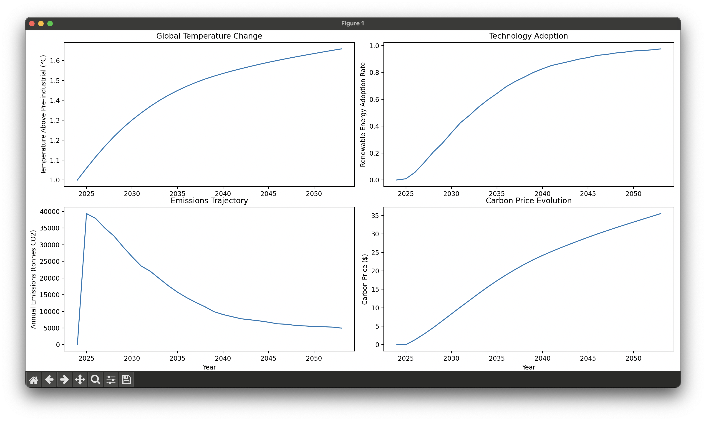

# Enhanced Climate ABM Simulation

The model simulates an energy transition from 2024 to 2054, tracking how households and firms adopt renewable energy, and how this affects global temperature and emissions. Here's what unfolds:

The Agents
- 1000 households and 100 firms are distributed across a simulated world
- Households cluster in three "city" locations while firms are spread out
- Each agent has unique characteristics: wealth, environmental awareness, and location
- Agents influence their neighbors' decisions through social networks

The Timeline

Early Phase (2024-2027):
- Adoption starts slowly with only early adopters making the switch
- Temperature rise continues from its 1.0°C starting point
- Carbon prices are low
- Emissions increase initially as the economy grows

Acceleration Phase (2028-2038):
- Renewable energy adoption takes off rapidly due to:
  * Falling technology costs (learning effects)
  * Rising carbon prices
  * Growing social influence
  * Increasing environmental concerns
- Emissions begin declining sharply
- Temperature rise starts to slow

Maturity Phase (2039-2054):
- Renewable adoption reaches over 90%
- Emissions fall to low levels
- Temperature stabilizes around 1.65°C
- Carbon price continues rising gradually

Key Outcomes:
1. Temperature rise is limited to 1.65°C, staying under the Paris Agreement's 2°C target
2. Nearly complete renewable energy adoption is achieved
3. Emissions fall by about 85% from their peak
4. Carbon prices rise steadily but modestly to around $35/ton

The simulation demonstrates how multiple factors - economics, policy, social influence, and environmental awareness - can work together to drive a successful energy transition. The S-shaped adoption curve matches real-world patterns of technological diffusion, while the emissions trajectory shows how rapid decarbonization could help limit global warming.

  

