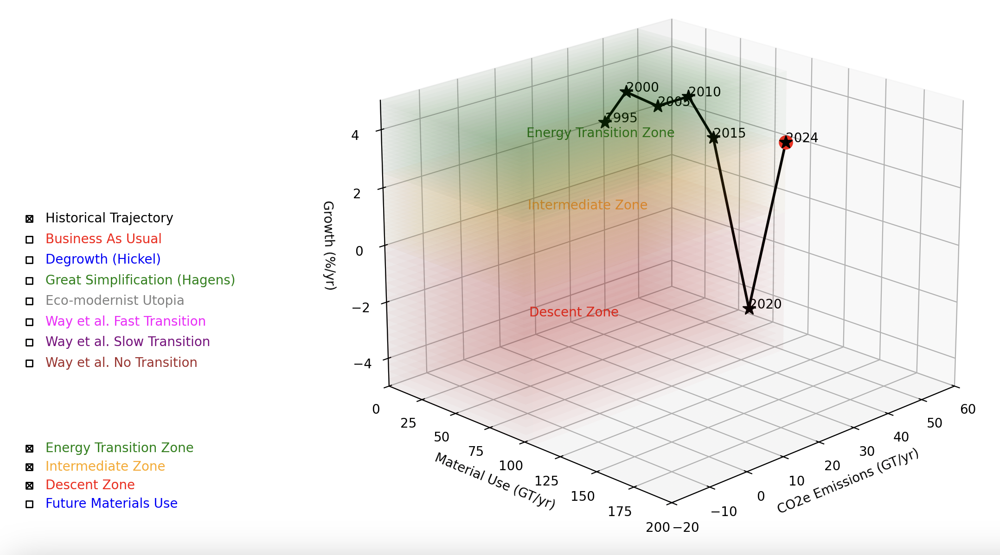

# Future Pathways: Where Are We Going (And Where Have We Been)?
Humanity and the biosphere face an uncertain future. Climate change, biodiversity loss and the depletion of natural resources are accelerating, forcing us to confront the reality that our current trajectory is unsustainable. As we come to terms and confront these crises, some of the most urgent questions we must answer are:
- **What futures are actually possible?**
- **What pathways to the future are open to us?**
- **What will it take to get there?**

This visualization offers a framework for exploring this question by mapping 
potential transition pathways through the complex interplay of three critical variables: 
economic growth, CO2 emissions, and material use.

  

[Future Pathways on YouTube](https://www.youtube.com/watch?v=KVNlFfpQ3Xw)

## A Lens for Viewing Possible Futures

The model creates a three-dimensional space where each axis represents a fundamental aspect of our 
civilization's trajectory:
- Economic Growth (measured in percent per year) - AKA "Progress", "Civilisation Complexity", "GDP"
- CO2 Emissions (gigatons per year)
- Material Use (gigatons per year)

  

Within this space, different "zones" represent possible states of civilization:

- The Energy Transition Zone (2.5-5% growth): Represents successful transition pathways where emissions decrease while maintaining or improving economic growth.

  

- The Intermediate Zone (0-2.5% growth): Represents moderate transition scenarios

  

- The Descent Zone (negative growth): Represents scenarios involving economic contraction

  

- The Future Materials Use Zone: Represents pathways involving increased material consumption

  

[Transition Zones on YouTube](https://www.youtube.com/watch?v=t3BuuyYv_OM)

## Where Are We?

Our current position in 2024 (red spot) sits at approximately 2.5% growth, 50 gigatons of CO2 emissions per 
year, and 106 gigatons of material use per year. From this starting point, the model plots 
several possible futures.

  

## Past Reality and Competing Visions of the Future

The model maps several distinct transition pathways, one showing our actual trajectory from 1995 to 
2024 while the others represent different philosophical and practical approaches to navigating our future:

### From 1995 to 2024
Since the first Conference of the Parties (COP1) climate conference in 1995 to the present day we 
have seen ever-increasing CO2e emissions and material use, while growth saw a significant reduction 
during the COVID-19 pandemic.

  

### Business as Usual (BAU)
This pathway shows the consequences of maintaining current trends: increasing emissions, growing 
material use, but gradually declining economic growth. The BAU trajectory suggests this approach 
may be fundamentally unsustainable.

  

### Degrowth (Hickel)
Based on Jason Hickel's work, this pathway envisions a managed reduction in resource consumption 
by wealthy nations while enabling development in poorer regions. The goal is to reach a steady 
state with zero growth, low emissions, and circular material use.

  

### The Great Simplification (Hagens)
Nate Hagens' concept of "measured decline" suggests a managed descent to lower resource use and 
emissions levels, acknowledging potential limitations in our ability to maintain current 
consumption patterns.

  

### Eco-modernist Utopia
This pathway represents an optimistic vision where technological innovation enables simultaneous 
reduction in emissions and material use while maintaining economic growth.

  

### Way et al. Transitions
The model includes three variations of transition pathways (Fast, Slow, and No Transition), 
helping visualize how the speed of change affects our trajectory through this three-dimensional 
space.

  

## Historical Trajectory: Learning from Three Decades of Data

The model's historical trajectory from 1995 to 2024 tells a sobering story about our progress since 
the first Conference of the Parties (COP1) climate conference. By plotting actual data points for 
global emissions, growth, and material use, we can trace humanity's path through this three-dimensional 
possibility space:

  

### 1995-2010: The Era of Unconstrained Growth
During this period, we see a steady climb across all three dimensions:
- CO2 emissions rose from 23.0 to 33.5 gigatons per year
- Material use increased from 45.0 to 78.0 gigatons per year
- Economic growth remained robust, averaging around 3-4% annually

This trajectory shows how economic growth was achieved through increasing material consumption and 
rising emissions, with little evidence of decoupling between these factors.

### 2010-2019: Acceleration Despite Awareness
Despite growing climate awareness and multiple COPs, this period showed:
- Continued acceleration of emissions from 33.5 to around 40 gigatons
- Material use growth from 78.0 to over 95 gigatons
- Maintained economic growth around 2.5-3%

The path during this period suggests that international climate agreements had little effect on the 
fundamental relationship between growth, materials, and emissions.

### 2020: The COVID-19 Disruption
The pandemic created a dramatic but temporary deviation:
- A sharp drop in emissions
- Negative economic growth (-3.3%)
- Slight decrease in material use

This unexpected experiment demonstrated that rapid emissions reductions are possible, but also 
highlighted the tight coupling between emissions and economic activity under our current system.

### 2020-2024: The Rebound
The post-pandemic period has shown:
- Quick return to pre-pandemic emission levels, reaching 50 gigatons
- Recovery of economic growth to 2.5%
- Material use reaching new highs at 106 gigatons

This "return to normal" suggests that without structural changes, even major disruptions lead only 
to temporary deviations from the established trajectory.

### Implications for Future Pathways

The historical trajectory provides several crucial insights:

1. **Persistent Coupling**: Despite technological advances and policy initiatives, we have not achieved significant decoupling of economic growth from emissions and material use.

2. **Accelerating Trends**: Rather than showing progress toward sustainability, our historical path shows acceleration in both emissions and material use.

3. **Zone Migration**: We have moved steadily away from the sustainable zones defined in the model, making future transitions increasingly challenging.

4. **Policy Effectiveness**: The minimal impact of three decades of climate negotiations on our actual trajectory suggests the need for more fundamental changes in approach.

5. **Transition Urgency**: The growing gap between our current position and sustainable zones highlights the increasing difficulty of achieving a successful energy transition without dramatic changes in direction.

Our historical trajectory shows the immense momentum of our current system. Even the unprecedented global disruption of COVID-19 only briefly reduced emissions and material use before they rebounded to previous levels, highlighting how deeply these are embedded in our economic structure.

This serves as a stark warning: transitioning to sustainability will take far more than incremental changes. It demands a fundamental transformation of how we operate as a civilization. Each year of delay widens the gap between our current path and a sustainable future, making the necessary transition steeper and more urgent.

We are not just failing to reduce emissions and material use—we are accelerating in the wrong direction. In the words of Professor Kevin Anderson: “we are choosing to fail”. Turning this around is like steering a supertanker; the longer we wait, the harder it becomes to avoid disaster. Can we implement sustainable solutions at the necessary scale and speed while maintaining social stability? I think we can, but it is going to be hard. What do you think?

## The Model as a Discussion Tool

Perhaps the most valuable aspect of this visualization is not its predictive power but its ability to facilitate meaningful discussions about our future options. By mapping different proposals in three-dimensional space, it helps us:

1. Visualize Trade-offs: The model makes explicit the relationships between growth, emissions, and material use, helping us understand what we might need to sacrifice to achieve specific goals.

2. Challenge Assumptions: By plotting different pathways, we can question whether certain combinations (like high growth with low emissions and material use) are realistically achievable.

3. Frame Debates: The model provides a common framework for discussing different approaches to transition, helping clarify where various proposals differ and where they might complement each other.

### Storytellers: Pathways as Future Narratives

Each trajectory through this three-dimensional space isn't just a line on a graph – it's a possible story of our future, complete with its own set of living conditions, challenges, and opportunities for the people who would inhabit that future. Thinking of these pathways as narratives can help us better understand what they might mean for daily life:

Consider the "Business as Usual" pathway: This is a story where we continue much as we are, but with increasing strain. It's a world of rising seas and changing weather patterns, where society spends more and more resources trying to adapt to environmental changes while maintaining current lifestyles. The characters in this story might be engineers building ever-higher sea walls, or farmers continually adjusting to new growing conditions.

The "Degrowth" pathway tells a different story: One where wealthy societies deliberately choose to use less, while supporting development in poorer regions. It might be a world of local production, repair cafes, and community gardens, where people work fewer hours but spend more time in community activities. The protagonists here might be teaching others how to grow food or repair electronics, or coordinating shared resource systems.

The "Great Simplification" narrative suggests a managed step-down in complexity: Perhaps a world where some modern technologies become luxury items rather than everyday conveniences, but where communities develop new (or rediscover old) ways of meeting their needs. Here we might find stories of people adapting to more seasonal lifestyles, or developing new social arrangements to share reduced resources.

The "Eco-modernist Utopia" spins a tale of technological triumph: Advanced nuclear power, carbon capture, and material recycling technologies enable continued growth while healing environmental damage. These would be stories of scientists and engineers developing breakthrough technologies, but also of society learning to use incredible power responsibly.

By thinking of these pathways as settings for human stories, we can better grasp:

1. The Human Element: How different futures might feel to live in, not just their technical parameters
2. Complex Trade-offs: The real implications of choices between growth, emissions, and material use
3. Adaptation Challenges: How societies might need to change along each pathway
4. Innovation Opportunities: What new ways of living might emerge in each scenario

This narrative approach helps bridge the gap between abstract models and lived experience, making the implications of different choices more tangible and relatable. It reminds us that whichever path we take, it will be traveled by real people with hopes, fears, and dreams – people who will need to navigate whatever world our choices create.

## The Visualization as a Cognitive Artifact

In discussing tools that help us think about complex problems, the Santa Fe Institute's David Krakauer makes use of
the concept of cognitive artifacts - tools that extend and enhance our ability to understand and 
reason about challenging concepts. Through this lens, our three-dimensional visualization of future pathways might serve
as a cognitive artifact, enhancing our ability to grasp and reason about possible futures in different ways.

### Cognitive Enhancement

As a cognitive artifact, the visualization acts as an external thinking tool that allows us to reason about possibilities 
in ways we couldn't easily do otherwise. Just as a calculator helps us perform complex calculations, this model helps us:

- Simultaneously visualize and manipulate three interrelated variables (growth, emissions, and material use) in a way our unaided minds might find difficult
- Compare different transition pathways within a common framework
- Identify relationships and trade-offs that might remain hidden in raw data or text descriptions
- Create a shared visual space for discussing and debating future scenarios

This function is particularly valuable when we need to communicate (tell stories) about possible futures with others or analyze specific transition proposals.

The visualization also aims to help us develop better thinking abilities even when we're not directly using it. Like mathematical notation, which gives us 
new ways to think about quantitative relationships, this intention is to provide:

- A mental framework for understanding the relationships between key variables in sustainability transitions
- An intuitive grasp of the constraints and trade-offs involved in different futures
- A structured way to think about the implications of current decisions on future possibilities
- A shared conceptual model that can enhance discussion and planning

Once internalized, this framework helps us think more systematically about sustainability transitions even in contexts 
where we don't have the visualization in front of us.

### Building Better Mental Models

Using this visualization as a cognitive artifact might help us build better mental models of possible futures. By making 
abstract concepts concrete and visible, it allows us to:

1. Develop Intuition: The spatial relationships in the model help build intuitive understanding of how different variables interact
2. Challenge Assumptions: The visual representation helps identify when our existing mental models might be flawed
3. Share Understanding: The model provides a common framework for discussing complex futures
4. Guide Action: The visualization helps connect current decisions to their long-term implications

This cognitive scaffolding is particularly valuable given the complexity of the sustainability challenges we face. 
As we grapple with decisions that will affect futures decades away, having tools that enhance our ability to think 
about and discuss these futures becomes increasingly crucial.

## Limitations and Future Development

While hopefully useful as a thinking and monitoring tool, the model should be understood as a framework for discussion and tracking rather than a precise prediction of future possibilities. Its value lies in helping us visualize, debate, and monitor different transition pathways, not in definitively stating which paths are viable or optimal.

The zones and pathways represented are necessarily simplified versions of complex proposals, and users are encouraged to critique and refine these representations based on their understanding of the underlying concepts. Similarly, when tracking real-world trajectories, it's important to consider factors that might not be captured in the three primary variables.

Hidden behind the three chosen axes are our impacts on the natural world: biodiversity and habitat loss, pollution and
increasing human encroachment across the globe. There's almost certainly other sets of interdependent axes to plot that 
inform us and tell stories about different future pathways.... let's see them!

## Your Pathway

As we navigate the challenges of climate change and resource constraints, tools that help us visualize and discuss possible futures become increasingly valuable. This 3D model offers a unique framework for understanding the relationships between key variables in our civilization's trajectory and the various proposals for managing transition.

By making explicit the trade-offs and relationships between growth, emissions, and material use, while also showing our actual historical trajectory, the model helps us move beyond simplified debates and toward a more nuanced understanding of the challenges and opportunities ahead. Whether we ultimately follow a path of managed descent, ambitious technological transformation, or something in between, understanding the full range of possibilities - and our current direction - is crucial for making informed decisions about our collective future.

The use of this visualisation is made freely available under the MIT licence to use how you wish, but more 
importantly to share so that others can also use it.

If you would like to get involved or provide feedback, please contact the author at:
bernard@solarnautics.org.

## Sources
- Way, R., et al. (2022). "Empirically grounded technology forecasts and the energy transition" INET Oxford Working Paper No. 2021-01
- Hickel, J. (2020). "Less is More: How Degrowth Will Save the World" William Heinemann, London
- Hickel, J. & Kallis, G. (2020). "Is Green Growth Possible?" New Political Economy, 25(4), 469-486
- Hagens, N. (2020). "Economics for the Future – Beyond the Superorganism" Ecological Economics, Volume 169
- Krakauer, D. (2016). "Worlds Hidden in Plain Sight: Thirty Years of Complexity Thinking at the Santa Fe Institute"

For material footprint and resource use data:
- UNEP International Resource Panel (2023). "Global Resources Outlook 2023"
- Circle Economy (2024). "Circularity Gap Report 2024"

For CO2 emissions data:
- Global Carbon Project (2023). "Global Carbon Budget 2023"
- IPCC (2023). "Climate Change 2023: Synthesis Report"

For global economic growth data:
- World Bank World Development Indicators
- IMF World Economic Outlook Database

Links:
- Nate Hagens "The Great Simplification": https://www.youtube.com/@thegreatsimplification
- The Energy Transition Show:
  - [Episode #239] – Making Sense of Chaos: https://xenetwork.org/ets/episodes/episode-239-making-sense-of-chaos/
  - [Episode #231] – Five Times Faster: https://xenetwork.org/ets/episodes/episode-231-five-times-faster/
  - [Episode #159] – The Cost of Decarbonization: https://xenetwork.org/ets/episodes/episode-159-the-cost-of-decarbonization/
